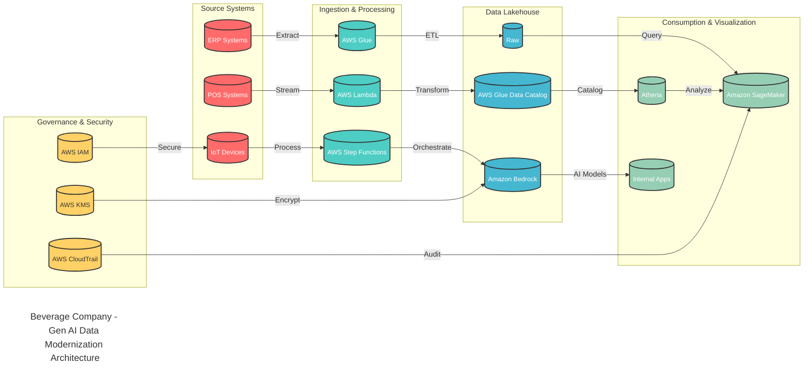

# Beverage Company - Gen AI Data Modernization Architecture

## Overview
This high-level architecture diagram illustrates the elegant Gen AI-powered data modernization journey for a leading beverage manufacturer, focusing on key AWS services and clean data flow.

## Key Components

### Source Systems
- **ERP Systems**: Enterprise resource planning data
- **POS Systems**: Point-of-sale transaction data  
- **IoT Devices**: Connected device data

### Ingestion & Processing
- **AWS Glue**: ETL processing for structured data
- **AWS Lambda**: Serverless processing for real-time data
- **AWS Step Functions**: Workflow orchestration

### Data Lakehouse
- **Raw**: Unprocessed source data storage
- **AWS Glue Data Catalog**: Centralized metadata management
- **Amazon Bedrock**: Foundation model service for AI applications

### Consumption & Visualization
- **Amazon SageMaker**: Machine learning and AI model deployment
- **Internal Apps**: Custom applications consuming AI insights
- **Athena**: Serverless query service for data analysis

### Governance & Security
- **AWS IAM**: Identity and access management
- **AWS KMS**: Encryption key management
- **AWS CloudTrail**: API call logging and auditing

## Data Flow

### 1. Data Ingestion
- ERP Systems → AWS Glue (Extract)
- POS Systems → AWS Lambda (Stream)
- IoT Devices → AWS Step Functions (Process)

### 2. Data Processing
- AWS Glue → Raw (ETL)
- AWS Lambda → AWS Glue Data Catalog (Transform)
- AWS Step Functions → Amazon Bedrock (Orchestrate)

### 3. AI & Analytics
- Raw → Amazon SageMaker (Query)
- AWS Glue Data Catalog → Athena (Catalog)
- Amazon Bedrock → Internal Apps (AI Models)
- Athena → Amazon SageMaker (Analyze)

### 4. Security & Governance
- AWS IAM secures IoT Devices
- AWS KMS encrypts Amazon Bedrock
- AWS CloudTrail audits Amazon SageMaker

## Key Benefits

### Business Impact
- **Simplified Data Flow**: Clean, linear processing pipeline
- **AI-Powered Insights**: Bedrock foundation models for intelligent applications
- **Self-Serve Analytics**: Athena provides easy data access
- **Scalable Architecture**: Cloud-native design for growth

### Technical Benefits
- **Elegant Design**: Clean, easy-to-understand architecture
- **Cost Optimization**: Pay-per-use pricing model
- **Security**: Enterprise-grade security and compliance
- **Innovation Ready**: Foundation for future AI initiatives

## Success Metrics
- Streamlined data processing pipeline
- Enhanced AI capabilities through Bedrock
- Improved data accessibility and insights
- Foundation for competitive advantage through AI
